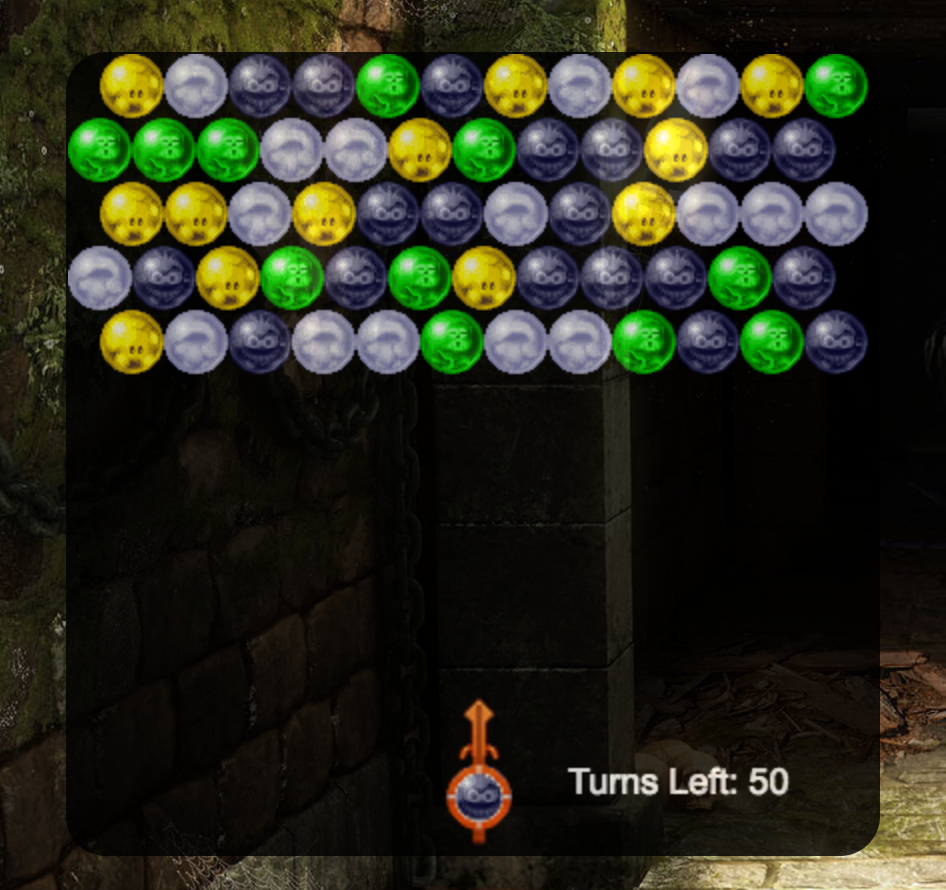

# Bubble Dungeon

[Live](www.zackyu.com/bubble_dungeon)

Bubble Dungeon is a clone of the classic bubble shooter game. This version will be turn based. The player needs to pop all the bubbles before the number of turns runs out. The player loses once they run out of turns or a bubble touches the bottom of the screen. It utilizes vanilla Javascript, HTML5 and CreateJS.

## How To Play

The name of the game is popping bubbles! To break bubbles just match
3 or more bubbles of the same color. Any floating bubbles will also pop.
User the `left` and `right` arrow keys to aim and the `space bar` to shoot.
Pop all the bubbles before you run out of turns to escape the dungeon!
